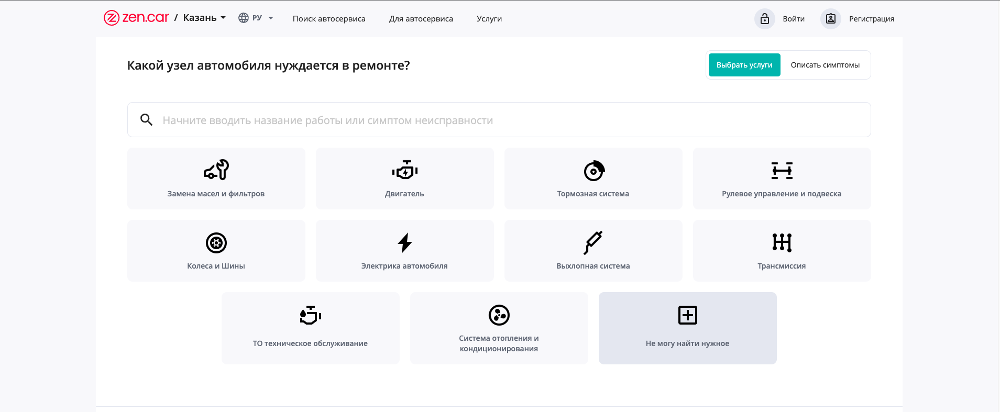
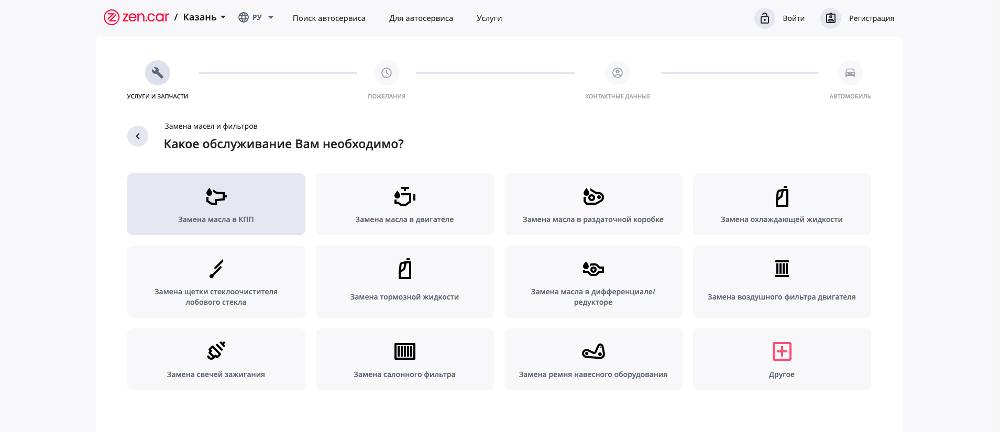
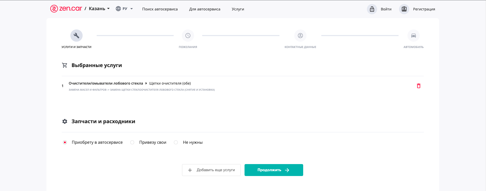

# test-project-frontend

Привет!

Суть технического задания: посмотреть, как ты справишься с реализацией небольшой части реального проекта.
При выполнении задания желательно применять архитектурные решения как если бы это был полноценный объемный коммерческий проект.

Главное нужно - разработать web приложение, которое по функциональности повторяет первый шаг создания обращения в сервисе ZEN.CAR.
В котором пользователь с помощью пошагового выбора услуг/симптомов получает конечный список работ и услуг.
Дальнейшие шаги создания обращения реализовывать не нужно.

Подробно познакомиться с данным функционалом можно по ссылке https://zen.car/repair-wizard.

Дизайн, стили и общую механику нужно взять со страницы. Если найдете баги, напишите в тех. поддержку)

API, необходимое для тестового задания реализовано на graphql

https://zencar-backend-dev.dev.zen.car/graphql - эндпоинт и документация данного API


Для выполнения задания понадобится использовать
- Query.wizardWorks()
<details><summary>Пример запроса на получение работ</summary>
<p>

```graphql
query {
  wizardWorks(where: {}, order: { orderIndex: asc }) {
    id
    parentId
    name
    question
    other
    vehicleWorks {
      id
      name
      action
      group {
        id
        parentId
        name
        parent {
          id
          name
          parent {
            id
            name
          }
        }
        createdAt
        updatedAt
      }
      createdAt
      updatedAt
    }
    image {
      id
      objectId
      objectType
      objectProperty
      filename
      mimetype
      encoding
      file {
        url
        path
      }
    }
    orderIndex
    createdAt
    updatedAt
    children(order: { orderIndex: asc }) {
      id
      parentId
      name
      question
      other
      vehicleWorks {
        id
        name
        action
        group {
          id
          parentId
          name
          parent {
            id
            name
            parent {
              id
              name
            }
          }
          createdAt
          updatedAt
        }
        createdAt
        updatedAt
      }
      image {
        id
        objectId
        objectType
        objectProperty
        filename
        mimetype
        encoding
        file {
          url
          path
        }
      }
      orderIndex
      createdAt
      updatedAt
      children(order: { orderIndex: asc }) {
        id
        parentId
        name
        question
        other
        vehicleWorks {
          id
          name
          action
          group {
            id
            parentId
            name
            parent {
              id
              name
              parent {
                id
                name
              }
            }
            createdAt
            updatedAt
          }
          createdAt
          updatedAt
        }
        image {
          id
          objectId
          objectType
          objectProperty
          filename
          mimetype
          encoding
          file {
            url
            path
          }
        }
        orderIndex
        createdAt
        updatedAt
        children(order: { orderIndex: asc }) {
          id
          parentId
          name
          question
          other
          vehicleWorks {
            id
            name
            action
            group {
              id
              parentId
              name
              parent {
                id
                name
                parent {
                  id
                  name
                }
              }
              createdAt
              updatedAt
            }
            createdAt
            updatedAt
          }
          image {
            id
            objectId
            objectType
            objectProperty
            filename
            mimetype
            encoding
            file {
              url
              path
            }
          }
          orderIndex
          createdAt
          updatedAt
          children(order: { orderIndex: asc }) {
            id
            parentId
            name
            question
            other
            vehicleWorks {
              id
              name
              action
              group {
                id
                parentId
                name
                parent {
                  id
                  name
                  parent {
                    id
                    name
                  }
                }
                createdAt
                updatedAt
              }
              createdAt
              updatedAt
            }
            image {
              id
              objectId
              objectType
              objectProperty
              filename
              mimetype
              encoding
              file {
                url
                path
              }
            }
            orderIndex
            createdAt
            updatedAt
          }
        }
      }
    }
  }
}

```

</p>
</details>

- Query.wizardSymptoms()


## Пример выбора работы
Первый шаг


Второй шаг


Третий шаг



## DOD задачи:
- Есть плитка работ/симптомов
- Пользователь может пройти по уровням дерева и получить список работ
- Пользователь может проходиться по дереву сколько угодно добавляя в список работы
- Бонусная часть, делается только по желанию, это у нас не будет использоваться. Только планируется.
    - Данные сохраняются в firebase firestore
    - Авторизация должна быть реализована через firebase authentication (достаточно использовать только email/password provider)
    - Приложение должно деплоиться в firebase hosting через стандартный механизм firebase deploy


## Дополнительная информация
Если хочешь сделать представление более удобно, не через плитки, ui и ux можешь реализовать свой вариант на текущих данных.

## Стэк технологий:

Желательно React или React native(достаточно только андроид сборку)


графика, при ее наличии, только в SVG формате

## Что мы ожидаем получить на выходе:
Приложение в git репозитории и инструкцией как его запустить
Ссылку на репозиторий присылаешь на почту am@zen.car, лучше еще продублировать в телеграм @quoterman

## Предложения и об ошибках можно написать в issues


